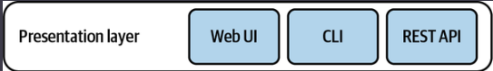
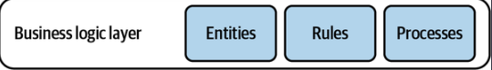
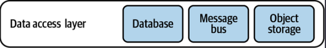
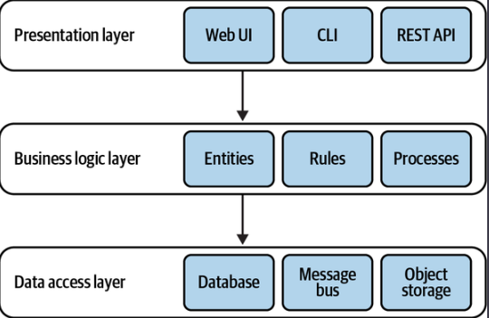
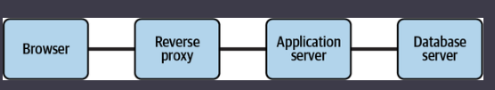
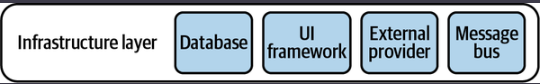
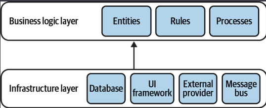
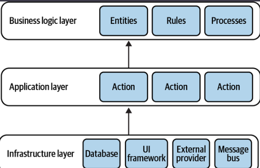

# **Chapter 1. Analyzing Business Domains**

# **Chapter 2. Discovering Domain Knowledge**

1. ## Business Problems
   
   1. The software systems we are building are solutions to business problems
   2. Business problems appear both at the business domain and subdomain levels.
      1. Subdomains are finer-grained problem domains whose goal is to provide solutions for specific business capabilities.
      2. A knowledge management subdomain optimizes the process of storing and retrieving information
2. ## Knowledge Discovery
   
   1. To design an effective software solution, we have to grasp at least the basic knowledge of the business domain.
   2. To be effective, the software has to mimic the domain experts’ way of thinking about the problem
   3. **As Alberto Brandolini1 says, software development is a learning process; working code is a side effect.**
   4. A software project’s success depends on the effectiveness of knowledge sharing between domain experts and software engineers.
   5. Effective knowledge sharing between domain experts and software engineers requires effective communication.
3. ## Communication
   
   1. software projects require the collaboration of stakeholders in different roles: domain experts, product owners, engineers, UI and UX designers, project managers, testers, analysts, and others
   2. 
   3. In any translation, information is lost; in this case, domain knowledge that is essential for solving business problems gets lost on its way to the software engineers.
   4. Domain-driven design proposes a better way to get the knowledge from domain experts to software engineers: by using a ubiquitous language.
4. ## What Is a Ubiquitous Language?
   
   1. Using a ubiquitous language is the cornerstone practice of domain-driven design.
   2. if parties need to communicate efficiently, instead of relying on translations, they have to speak the same language.
   3. The traditional software development lifecycle implies the following translations:
      - Domain knowledge into an analysis model
      - Analysis model into requirements
      - Requirements into system design
      - System design into source code
   4. Instead of continuously translating domain knowledge, domain-driven design calls for cultivating a single language for describing the business domain: the ubiquitous language.
   5. All project-related stakeholders—software engineers, product owners, domain experts, UI/UX designers—should use the ubiquitous language when describing the business domain.
5. ## Language of the Business
   
   1. It’s crucial to emphasize that the ubiquitous language is the language of the business
   2. As such, it should consist of business domain–related terms only. No technical jargon!
      1. ### Consistency
         
         1. The ubiquitous language must be precise and consistent.
         2. each term of the ubiquitous language should have one and only one meaning
            1. *Ambiguous terms*
               - Ubiquitous language demands a single meaning for each term, so “policy” should be modeled explicitly using the two terms regulatory rule and insurance contract.
            2. *Synonymous terms*
               - Two terms cannot be used interchangeably in a ubiquitous language.
6. ## Model of the Business Domain
   
   1. ### What Is a Model?
      
      1. A model is not a copy of the real world but a human construct that helps us make sense of real-world systems.
   2. ### Effective Modeling
      
      1. All models have a purpose, and an effective model contains only the details needed to fulfill its purpose.
      2. a useful model is not a copy of the real world. Instead, a model is intended to solve a problem, and it should provide just enough information for that purpose.
      3. In its essence, a model is an abstraction
         1. The notion of abstraction allows us to handle complexity by omitting unnecessary details and leaving only what’s needed for solving the problem at hand.
   3. ### Modeling the Business Domain
      
      1. The model is supposed to capture the domain experts’ mental models
      2. The model has to reflect the involved business entities and their behavior, cause and effect relationships, and invariants.
      3. The ubiquitous language we use is not supposed to cover every possible detail of the domain
      4. Instead, the model is supposed to include just enough aspects of the business domain to make it possible to implement the required system
      5. Effective communication between engineering teams and domain experts is vital.
   4. ### Continuous Effort
      
      1. Only interactions with actual domain experts can uncover inaccuracies, wrong assumptions, or an overall flawed understanding of the business domain.
      2. All stakeholders should consistently use the ubiquitous language in all project-related communications to spread knowledge about and foster a shared understanding of the business domain.
      3. cultivation of a ubiquitous language is an ongoing process.
   5. ### Tools
      
      1. a wiki can be used as a glossary to capture and document the ubiquitous language
      2. It’s important to make glossary maintenance a shared effort. When a ubiquitous language is changed, all team members should be encouraged to go ahead and update the glossary
      3. Automated tests written in the Gherkin language are not only great tools for capturing the ubiquitous language but also act as an additional tool for bridging the gap between domain experts and software engineers.
      
      ```
      Scenario: Notify the agent about a new support case
              Given Vincent Jules submits a new support case saying:
              """
              I need help configuring AWS Infinidash
              """
              When the ticket is assigned to Mr. Wolf
              Then the agent receives a notification about the new ticket
      ```
      
      4. Finally, there are even static code analysis tools that can verify the usage of a ubiquitous language’s terms. A notable example for such a tool is NDepend
   6. ### Challenges
      
      1. In theory, cultivating a ubiquitous language sounds like a simple, straightforward process. In practice, it isn’t.
      2. The only way to access it is to ask questions to Domain Experts.
      3. Furthermore, you may encounter business domain concepts that lack explicit definitions
      4. the learning process is mutual—you are helping the domain experts better understand their field.
      5. The essential tool in such a situation is patience.
      6. My advice is to at least use English nouns for naming the business domain’s entities.
   7. ### Conclusion
      
      1. Effective communication and knowledge sharing are crucial for a successful software project.
      2. Software engineers have to understand the business domain in order to design and build a software solution.
      3. Domain-driven design’s ubiquitous language is an effective tool for bridging the knowledge gap between domain experts and software engineers.
      4. Cultivating a ubiquitous language is a continuous process. As the project evolves, more domain knowledge will be discovered. It’s important for such insights to be reflected in the ubiquitous language.
      5. To ensure effective communication, the ubiquitous language has to eliminate ambiguities and implicit assumptions. All of a language’s terms have to be consistent

# **Chapter 3. Managing Domain Complexity**

- **Notes**: To ensure a project’s success it’s crucial that you develop a ubiquitous language that can be used for communication by all stakeholders, from software engineers to domain experts. The language should reflect the domain experts’ mental models of the business domain’s inner workings and underlying principles.

1. ## Inconsistent Models
   
   1. each term should have one meaning. ubiquitous language has to be consistent
      - 
      - it is more difficult to represent such a divergent model of the business domain in software. Source code doesn’t cope well with ambiguity. If we were to bring the sales department’s complicated model into marketing, it would introduce complexity where it’s not needed
   2. a solution would be to prefix the problematic term with a definition of the context: “marketing lead” and “sales lead.”
   3. this approach has two main disadvantages. First, it induces cognitive load
      1. First, it induces cognitive load. The closer the implementations of the conflicting models are, the easier it is to make a mistake.
      2. Second, the implementation of the model won’t be aligned with the ubiquitous language. No one would use the prefixes in conversations.
   4. the domain-driven design pattern for tackling such scenarios: the bounded context pattern.
2. ## What Is a Bounded Context?
   
   1. The solution in domain-driven design is trivial: **divide the ubiquitous language into multiple smaller languages, then assign each one to the explicit context in which it can be applied: its bounded context.**
   2. marketing and sales. The term lead exists in both bounded contexts
      - 
   3. ### *Model Boundaries*
      
      1. A model is not a copy of the real world but a construct that helps us make sense of a complex system.
      2. The problem it is supposed to solve is an inherent part of a model—its purpose.
      3. A model cannot exist without a boundary; it will expand to become a copy of the real world. That makes defining a model’s boundary—its bounded contexts—an intrinsic part of the modeling process.
      4. **an ubiquitous language** in one bounded context can be completely irrelevant to the scope of another bounded context.
      5. **Bounded contexts** define the applicability of a ubiquitous language and of the model it represents.
      6. In other words, bounded contexts are the consistency boundaries of ubiquitous languages.
   4. ### *Ubiquitous Language Refined*
      
      1. Bounded contexts allow us to complete the definition of a ubiquitous language.
      2. A ubiquitous language is not universal.
      3. Instead, a ubiquitous language is ubiquitous only in the boundaries of its bounded context. The language is focused on describing only the model that is encompassed by the bounded context.
   5. ### *Scope of a Bounded Context*
      
      1. To model the business domain, we had to divide the model and define a strict applicability context for each fine-grained model—its bounded context.
      2. The consistency of the ubiquitous language only helps to identify the widest boundary of that language.
      3. 
      4. Defining the scope of a ubiquitous language—its bounded context—is a strategic design decision.
      5. Models shouldn’t necessarily be big or small. Models need to be useful.
      6. The wider the boundary of the ubiquitous language is, the harder it is to keep it consistent.
      
      - **Notes**:  It may be beneficial to divide a large ubiquitous language into smaller, more manageable problem domains, but striving for small bounded contexts can backfire too. The smaller they are, the more integration overhead the design induces.
      
      7. To avoid such ineffective decomposition, use the rule of thumb we discussed in Chapter 1 to find subdomains: identify sets of coherent use cases that operate on the same data and avoid decomposing them into multiple bounded contexts.
3. ## Bounded Contexts Versus Subdomains
   
   1. a business domain consists of multiple subdomains.
   2. ### *Subdomains*
      
      1. According to domain-driven design methodology, the analysis phase involves identifying the different subdomains (core, supporting, and generic).
      2. a subdomain resembles a set of interrelated use cases.
      3. we are analyzing the business domain to identify the subdomains.
      4. As software engineers, we do not define the requirements; that’s the responsibility of the business.
   3. ### *Bounded Contexts*
      
      1. Bounded contexts, on the other hand, are designed. Choosing models’ boundaries is a strategic design decision. We decide how to divide the business domain into smaller, manageable problem domains.
   4. ### *The Interplay Between Subdomains and Bounded Contexts*
      
      1. 
      2. 
      3. If the models are still large and hard to maintain, we can decompose them into even smaller bounded contexts
      4. 
      5. Having a one-to-one relationship between bounded contexts and subdomains can be perfectly reasonable in some scenarios. In others, however, different decomposition strategies can be more suitable.
      6. It’s crucial to remember that subdomains are discovered and bounded contexts are designed.
      7. The subdomains are defined by the business strategy. However, we can design the software solution and its bounded contexts to address the specific project’s context and constraints.
4. ## Boundaries
   
   1. The bounded context pattern is the domain-driven design tool for defining physical and ownership boundaries.
   2. ### *Pyhsical Boundaries*,
      
      1. Each bounded context should be implemented as an individual service/project, meaning it is implemented, evolved, and versioned independently of other bounded contexts.
      2. Clear physical boundaries between bounded contexts allow us to implement each bounded context with the technology stack that best fits its needs.
      3. a bounded context can contain multiple subdomains. In such a case, the bounded context is a physical boundary, while each of its subdomains is a logical boundary.
   3. ### *Ownership Boundaries*
      
      1. we can leverage model boundaries—bounded contexts—for the peaceful coexistence of teams.
      2. The division of work between teams is another strategic decision that can be made using the bounded context pattern.
      3. A bounded context should be implemented, evolved, and maintained by one team only.
      4. No two teams can work on the same bounded context. This segregation eliminates implicit assumptions that teams might make about one another’s models. Instead, they have to define communication protocols for integrating their models and systems explicitly.
      5. 
5. ## Bounded Contexts in Real Life
   
   1. ### *Semantic Domains*
      
      1. It can be said that domain-driven design’s bounded contexts are based on the lexicographical notion of semantic domains. A semantic domain is defined as an area of meaning and the words used to talk about it. For example, the words monitor, port, and processor have different meanings in the software and hardware engineering semantic domains.
   2. ### *Science*
      
      1. Even though the two models can be seen as contradictory, both are useful in their suitable (bounded) contexts.
   3. Using two models, each optimized for its specific task, reflects the DDD approach to modeling business domains.
   4. Each model has its strict bounded context:
6. ## Conclusion
   
   1. Whenever we stumble upon an inherent conflict in the domain experts’ mental models, we have to decompose the ubiquitous language into multiple bounded contexts
   2. Bounded contexts decompose a system into physical components—services, subsystems, and so on

# **Chapter 4. Integrating Bounded Contexts**

1. Not only does the bounded context pattern protect the consistency of a ubiquitous language, it also enables modeling.
2. You cannot build a model without specifying its purpose—its boundary.
3. Moreover, models in different bounded contexts can be evolved and implemented independently.
4. There will always be touchpoints between bounded contexts. These are called contracts.
5. The need for contracts results from differences in bounded contexts’ models and languages.
6. ## Cooperation
   
   1. Cooperation patterns relate to bounded contexts implemented by teams with well-established communication.
   2. ### **Partnership**
      
      1. One team can notify a second team about a change in the API, and the second team will cooperate and adapt—no drama or conflicts. Both sides cooperate in solving any integration issues that might come up
      2. 
      3. This pattern might not be a good fit for geographically distributed team
   3. ### **Shared Kernel**
      
      1. 
      2. **Shared scope**
         1. To minimize the cascading effects of changes, the overlapping model should be limited, exposing only that part of the model that has to be implemented by both bounded contexts
      3. **Implementation**
         1. If the organization uses the mono-repository approach, these can be the same source files referenced by multiple bounded contexts. If using a shared repository is not possible, the shared kernel can be extracted into a dedicated project and referenced in the bounded contexts as a linked library
      4. **When**
         1. only when integrating changes applied to the shared model by both bounded contexts will require more effort than coordinating the changes in the shared codebase
         2. The difference between the integration and duplication costs depends on the volatility of the model
         3. The more frequently it changes, the higher the integration costs will be. Therefore, the shared kernel will naturally be applied for the subdomains that change the most: the core subdomains.
         4. Finally, a shared kernel can be a good fit for integrating bounded contexts owned and implemented by the same team.
         5. A shared kernel can be used for explicitly defining the bounded contexts’ integration contracts.
7. ## Customer–Supplier
   
   1. 
   2. Provides a service for its customers. The service provider is “upstream” and the customer or consumer is “downstream.”
   3. both teams (upstream and downstream) can succeed independently. Consequently, in most cases we have an imbalance of power: either the upstream or the downstream team can dictate the integration contract
   4. **three patterns addressing such power differences**
      #### Conformist
      
      1. If the downstream team can accept the upstream team’s model, the bounded contexts’ relationship is called conformist
      2. the contract exposed by the upstream team may be an industry-standard, well-established model, or it may just be good enough for the downstream team’s needs and conformed by downstream team.
      
      #### Anticorruption Layer
      
      1. it can translate the upstream bounded context’s model into a model tailored to its own needs via an anticorruption layer
      
      - consumer is not willing to accept the supplier’s model.
      
      2. The anticorruption layer pattern addresses scenarios in which **it is not desirable** or **worth the effort to conform to the supplier’s model**
      
      - **When the downstream bounded context contains a core subdomain**
      - **When the upstream model is inefficient or inconvenient for the consumer’s needs**
      - **When the supplier’s contract changes often**
      
      #### Open-Host Service
      
      1. the supplier implements the translation of its internal model.
      2. the upstream supplier decouples the implementation model from the public interface
      3. Logging framework?
8. ## Separate Ways
   
   1. The last collaboration option is not to collaborate at all.
   2. The separate ways pattern should be avoided when integrating core subdomains. Duplicating the implementation of such subdomains would defy the company’s strategy to implement them in the most effective and optimized way.
9. ## Context Map
   
   1. After analyzing the integration patterns between a system’s bounded contexts, we can plot them on a context map
   
   - 
     - High-level design: A context map provides an overview of the system’s components and the models they implement.
     - Communication patterns: A context map depicts the communication patterns among teams
     - Organizational issues: A context map can give insight into organizational issues.
10. ## Conclusion
    
    1. Bounded contexts are not independent. They have to interact with one another. The following patterns define different ways bounded contexts can be integrated
       - **Partnership**
         Bounded contexts are integrated in an ad hoc manner.
       - **Shared kernel**
         - Two or more bounded contexts are integrated by sharing a limited overlapping model that belongs to all participating bounded contexts.
       - **Conformist**
         - The consumer conforms to the service provider’s model.
       - **Anticorruption layer**
         - The consumer translates the service provider’s model into a model that fits the consumer’s needs.
       - **Open-host service**
         - The service provider implements a published language—a model optimized for its consumers’ needs.
       - **Separate ways**
         - It’s less expensive to duplicate particular functionality than to collaborate and integrate it.

# **Chapter 5. Implementing Simple Business Logic**

- Business logic is the most important part of software. It’s the reason the software is being implemented in the first place

2. # Transaction Script [Transactional Behaviour]
   
   1. A system’s public interface can be seen as a collection of business transactions that consumers can execute
   2. The pattern organizes the system’s business logic based on procedures, where each procedure implements an operation that is executed by the system’s consumer via its public interface.
   3. the system’s public operations are used as encapsulation boundaries.
   
   ## Implementation
   
   1. The only requirement procedures have to fulfill is transactional behavior. Each operation should either succeed or fail but can never result in an invalid state.
   2. if execution of a transaction script fails at the most inconvenient moment, the system should remain consistent—either by rolling back any changes it has made up until the failure or by executing compensating actions.
   3. Below example shows ACID that we should remain system as invalid state.
   4. But its only applicable in relational local database.

   - **Problem** and **Solution**
    ```
    public class LogVisit
    {
        ...
        public void Execute(Guid userId, DataTime visitedOn)
        {
            _db.Execute("UPDATE Users SET last_visit=@p1 WHERE user_id=@p2",
                  visitedOn, userId);
            _db.Execute(@"INSERT INTO VisitsLog(user_id, visit_date)
                           VALUES(@p1, @p2)", userId, visitedOn);
        }
    }
    public class LogVisit
    {
        ...

        public void Execute(Guid userId, DataTime visitedOn)
        {
            try
            {
                _db.StartTransaction();

                _db.Execute(@"UPDATE Users SET last_visit=@p1
                        WHERE user_id=@p2",
                        visitedOn, userId);

                _db.Execute(@"INSERT INTO VisitsLog(user_id, visit_date)
                        VALUES(@p1, @p2)",
                        userId, visitedOn);

                _db.Commit();
            } catch {
                _db.Rollback();
                throw;
            }
        }
    }

    ```
    ## Distributed transactions
    1. In modern distributed systems, it’s a common practice to make changes to the data in a database and then notify other components of the system about the changes by publishing messages into a message bus.
    2. As in the previous example, any failure occurring after line 7 but before line 9 succeeds will corrupt the system’s state. Unfortunately, fixing the issue is not as easy as in the previous example.
    ```
    public void Execute(Guid userId, DataTime visitedOn)
    {
        _relational.Execute("UPDATE Users SET last_visit=@p1 WHERE user_id=@p2", visitedOn,userId);
        _messageBus.Publish("VISITS_TOPIC", new { UserId = userId, VisitDate = visitedOn });
    }

    ```
    ### Implicit distributed transactions
    1. 
    2. if below method is part of a REST service and there is a network outage.
    3. if any failure case, client migght retry network call again it can make system as invalid state. There is not simple fix for this.
    4. one way to ensure transactional behavior is to make the operation ***idempotent***:
    5. another way, we can ask the consumer to pass the value of the counter. To supply the counter’s value, the caller will have to read the current value first, increase it locally, and then provide the updated value as a parameter.
    ```
    public void Execute(Guid userId)
    {
        _db.Execute("UPDATE Users SET visits=visits+1 WHERE user_id=@p1",
                    userId);
    }
    ```

    ### When to Use Transaction Script
    1. in extract-transform-load (ETL) operations, each operation extracts data from a source, applies transformation logic to convert it into another form, and loads the result into the destination store.
    - 
    2. The transaction script pattern naturally fits supporting subdomains where, by definition, the business logic is simple.
    3. this pattern won’t cope with the high complexity of a core subdomain’s business logic.
    4. Sometimes the pattern is even treated as an antipattern. 

2. # Active Record [anemic domain model antipattern]
- Notes: active record supports cases where the business logic is simple. however, the business logic may operate on more complex data structures.
- 
    ## Implementation
    1. Consequently, this pattern uses dedicated objects, known as active records, to represent complicated data structures.
    2. These objects also implement data access methods for creating, reading, updating, and deleting records—the so-called CRUD operations.
    3. As a result, the active record objects are coupled to an object-relational mapping (ORM) or some other data access framework. 
    4. As in the previous pattern, the system’s business logic is organized in a transaction script. The difference between the two patterns is that in this case, instead of accessing the database directly, the transaction script manipulates active record objects.
    5. The pattern’s goal is to encapsulate the complexity of mapping the in-memory object to the database’s schema
    6. being responsible for persistence, the active record objects can contain business logic; for example, validating new values assigned to the fields, or even implementing business-related procedures that manipulate an object’s data.
    ```
    public void Execute(userDetails)
    {
        try
        {
            _db.StartTransaction();
            var user = new User();
            user.Name = userDetails.Name;
            user.Email = userDetails.Email;
            user.Save();
            _db.Commit();
        } catch {
            _db.Rollback();
            throw;
        }
    }
    ```
    ## When to Use Active Record
    1. Because an active record is essentially a transaction script that optimizes access to databases, this pattern can only support relatively simple business logic, such as CRUD operations, which, at most, validate the user’s input.
    2.  The difference between the patterns [Transaction and Active Record] is that active record addresses the complexity of mapping complicated data structures to a database’s schema.
        - Active Record we used mapped database objects ***ORM***.
        - Transaction Pattern we directly access the database.
    5. The active record pattern is also known as an anemic domain model antipattern;
    
# **Chapter 6. Tackling Complex Business Logic**


